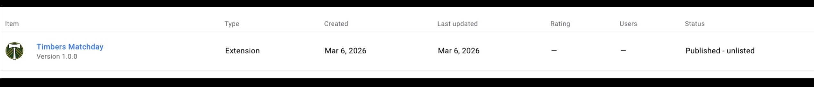
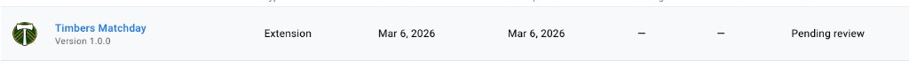

# Portland Timbers Matchday

[](https://github.com/Tony5897/timbers-chrome-ext/actions/workflows/ci.yml) [](https://codecov.io/gh/Tony5897/timbers-chrome-ext)

A cross-browser extension (Chrome and Safari) that displays upcoming Portland Timbers matches with a live countdown, TV/streaming info, and a fan confidence poll.

## Features

- Live countdown to the next Timbers match
- Match date/time, venue, and TV/streaming details
- Fan confidence poll with community vote breakdown
- One-click access to the official MLS schedule
- Hourly background refresh via service worker
- Timbers-branded dark-green and gold UI

## Browser Support

| Browser | Minimum Version | Status |
|---------|----------------|--------|
| Chrome  | 102+           | Supported |
| Edge    | 102+           | Supported (Chromium-based) |
| Safari  | 15.4+          | Supported (via Xcode conversion) |

## Installation

### Prerequisites

- Node.js (LTS) and npm

### Setup

```bash
git clone https://github.com/Tony5897/timbers-chrome-ext.git
cd timbers-chrome-ext
npm install
npm run build:icons
```

### Chrome / Edge

1. Navigate to `chrome://extensions` (or `edge://extensions`)
2. Enable **Developer mode**
3. Click **Load unpacked** and select the project root folder

### Safari (macOS)

Safari requires converting the extension into an Xcode project using Apple's tooling.

**Requirements:** macOS with full [Xcode](https://developer.apple.com/xcode/) installed (not just Command Line Tools).

1. Set Xcode as the active developer directory (one-time):

   ```bash
   sudo xcode-select -s /Applications/Xcode.app
   ```

2. Run the conversion script:

   ```bash
   npm run build:safari
   ```

   This creates a `safari/` directory containing the Xcode project.

3. Open the generated Xcode project:

   ```bash
   open safari/Timbers\ Matchday/Timbers\ Matchday.xcodeproj
   ```

4. In Xcode, select a signing team under **Signing & Capabilities**, then build and run (Cmd+R).

5. Enable the extension in Safari:
   - Safari > Settings > Extensions > enable **Timbers Matchday**

**For unsigned development builds:**
- Safari > Settings > Advanced > check **Show Develop menu in menu bar**
- Develop > **Allow Unsigned Extensions** (requires re-enabling after each Safari restart)

### Safari API Compatibility

All APIs used by this extension are natively supported in Safari 15.4+:

- `chrome.runtime` (sendMessage, onMessage)
- `chrome.storage.local`
- `chrome.alarms`
- MV3 service workers

No polyfills or browser-specific code paths are required. The `chrome` namespace works natively in Safari Web Extensions.

## Usage

Click the Timbers Matchday icon in the browser toolbar to open the popup. The extension automatically fetches the latest schedule data from the ESPN sports API and displays the next upcoming match with a live countdown timer.

Use the **Confidence Poll** section to vote on your confidence level and see how other fans are feeling.

## Development

### npm Scripts

| Command | Description |
|---------|-------------|
| `npm test` | Run Jest test suite with coverage |
| `npm run test:watch` | Run tests in watch mode |
| `npm run lint` | Run ESLint |
| `npm run build:icons` | Generate 16/48/128px icons from `icon.png` |
| `npm run build:safari` | Convert to Safari Web Extension (requires Xcode) |

### Project Structure

```
timbers-chrome-ext/
├── background.js             # Service worker — fetches and caches match data
├── popup.html                # Extension popup UI
├── popup.js                  # Popup logic — countdown, voting, data display
├── styles.css                # Popup stylesheet (CSS custom properties design system)
├── manifest.json             # Extension manifest (MV3)
├── icon.png                  # Source icon (640×668)
├── icons/                    # Generated extension icons
│   ├── icon-16.png
│   ├── icon-48.png
│   └── icon-128.png
├── scripts/
│   ├── generate-icons.js     # Sharp-based icon generator
│   └── convert-safari.sh     # Safari Web Extension converter wrapper
├── tests/
│   ├── scraper.test.js       # Background scraper unit tests
│   ├── popup.test.js         # Popup UI and integration tests
│   └── mocks/
│       └── styleMock.js      # Jest CSS mock
├── .github/workflows/ci.yml  # GitHub Actions CI pipeline
├── PRIVACY.md                # Privacy policy
└── LICENSE                   # ISC License
```

## Extension Messaging Architecture

Chrome extensions run in isolated execution contexts — the popup UI and the background service worker cannot share memory or call each other's functions directly. This project uses Chrome's runtime messaging API to bridge them.

### Data flow

```text
┌─────────────┐   sendMessage({ action: 'getMatchData' })   ┌──────────────┐
│  popup.js   │ ──────────────────────────────────────────▶  │ background.js│
│  (popup UI) │                                              │ (service wkr)│
│             │ ◀──────────────────────────────────────────  │              │
└─────────────┘   sendResponse({ matchData })                └──────┬───────┘
                                                                    │
                                                     fetchAndParseSchedule()
                                                                    │
                                                                    ▼
                                              site.api.espn.com (ESPN sports API)
```

1. **Popup opens** — `popup.js` dispatches `chrome.runtime.sendMessage({ action: 'getMatchData' })` and shows a skeleton loader while waiting.
2. **Background handles request** — `background.js` listens via `chrome.runtime.onMessage.addListener` and attempts a three-tier resolution: live fetch from the ESPN sports API (`site.api.espn.com`), cached data from `chrome.storage.local`, then a bundled fallback fixture (`data/fallback.json`). The response includes a `source` field (`'live'`, `'cache'`, or `'fallback'`) so the popup can indicate data freshness.
3. **Popup renders** — On success the popup displays match data and starts the countdown timer. If the data came from cache or fallback, a subtle notice is shown. The error state only appears if all three tiers return nothing.

### Periodic refresh

The background service worker creates a `chrome.alarms` alarm (`fetchDataAlarm`, 60-minute interval) that independently fetches and caches match data in `chrome.storage.local`. This ensures fresh data is available even if the popup hasn't been opened recently — and avoids redundant network requests when the user does open it.

### Vote persistence

Fan confidence votes are stored entirely in `chrome.storage.local` (`votes` and `hasVoted` keys). The popup reads existing votes on load and writes new votes on click, with no round-trip to the background worker required.

## Security Considerations

- **Manifest V3 service workers** — No persistent background page; the service worker is event-driven and terminates when idle, reducing memory footprint and attack surface.
- **Minimal permissions** — Only `storage`, `alarms`, and two host permissions (`site.api.espn.com` and `google-analytics.com`). No `tabs`, `activeTab`, `webRequest`, or broad host access.
- **No remote code execution** — All JavaScript is bundled locally. No CDN imports, no `eval()`, no dynamically injected scripts.
- **CSP-compliant** — No inline scripts in `popup.html`; all logic loads from `popup.js` via a standard `<script>` tag, satisfying Chrome's extension Content Security Policy.
- **Structured data only** — Match data is consumed as parsed JSON from the ESPN API. No raw HTML is injected into the popup.

## Chrome Web Store

**Status: Published — unlisted**



The extension is live on the Chrome Web Store and installable via direct link. It was submitted and approved on March 6, 2026.

<details>
<summary>Submission history</summary>



</details>

- **Manifest V3** compliant
- Icons at 16px, 48px, and 128px
- Minimal permissions (`storage`, `alarms`, single host)
- Privacy policy included (`PRIVACY.md`)
- No remote code execution; all logic is bundled locally

## Privacy

See [PRIVACY.md](PRIVACY.md) for the full privacy policy.

**Summary:** Match data and poll state are stored locally on your device. The extension fetches publicly available schedule data from the ESPN sports API and sends anonymous usage events to Google Analytics via the GA4 Measurement Protocol. No personally identifiable information is collected or shared.

## Telemetry

Product analytics use **GA4 Measurement Protocol** via direct `fetch()` — no gtag.js, no Google Tag Manager, no remotely hosted scripts. MV3-safe and Chrome Web Store-compliant.

### Secret handling

| File | Committed | Purpose |
|------|-----------|---------|
| `telemetry.example.js` | ✅ Yes | Template — copy this to get started |
| `telemetry.local.js` | ❌ Gitignored | Your real Measurement ID + API Secret |

To set up locally after cloning:

```bash
cp telemetry.example.js telemetry.local.js
# Edit telemetry.local.js and replace placeholder values with your GA4 credentials
```

### Events tracked

| Event | Fired from | Key params |
|-------|-----------|-----------|
| `popup_open` | popup | `ui_surface` |
| `match_fetch_started` | background | `ui_surface` |
| `match_fetch_live_success` | background | `source`, `has_match_data`, `fetch_duration_ms` |
| `match_fetch_cache_used` | background | `source`, `has_match_data` |
| `match_fetch_fallback_used` | background | `source`, `has_match_data` |
| `match_fetch_failed` | popup + background | `has_match_data` |
| `schedule_link_clicked` | popup | `ui_surface` |

### Verifying in GA4 Realtime

1. Load the extension unpacked with `telemetry.local.js` present
2. Open GA4 → Reports → Realtime
3. Click the extension popup — `popup_open` should appear within ~30 seconds
4. Use the DebugView (`Admin → DebugView`) for event-level parameter inspection

## Contributing

1. Fork the repository
2. Create a feature branch (`git checkout -b feat/my-feature`)
3. Commit your changes and push to your fork
4. Open a pull request against `develop`

## License

This project is licensed under the ISC License. See [LICENSE](LICENSE).
