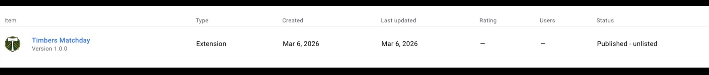
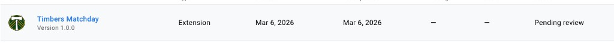

# Portland Timbers Matchday

[](https://github.com/Tony5897/timbers-chrome-ext/actions/workflows/ci.yml) [](https://codecov.io/gh/Tony5897/timbers-chrome-ext)

A Chrome-first matchday extension that displays upcoming Portland Timbers matches with a live countdown, TV/streaming info, and an integrity-controlled fan confidence poll. Safari conversion remains available as a compatibility target; Portland Thorns support is represented in shared platform contracts but is not enabled in the extension.

## Strategic Roadmap

The Chrome-first, multi-team platform architecture and phased implementation plan is documented in [docs/STRATEGIC_IMPLEMENTATION_PLAN.md](docs/STRATEGIC_IMPLEMENTATION_PLAN.md). Its independent requirement, platform, and readiness audit is in [docs/STRATEGIC_IMPLEMENTATION_PLAN_REVIEW.md](docs/STRATEGIC_IMPLEMENTATION_PLAN_REVIEW.md). Current implementation and production gates are tracked in [docs/IMPLEMENTATION_STATUS.md](docs/IMPLEMENTATION_STATUS.md), with the ordered Phase 0 cutover in [docs/runbooks/phase-0-deployment.md](docs/runbooks/phase-0-deployment.md).

## Features

- Live countdown to the next Timbers match
- Match date/time, venue, and TV/streaming details
- Fan confidence poll with community vote breakdown
- Self-service deletion for retained community responses and anonymous identity
- One-click access to the official MLS schedule
- Hourly background refresh via service worker
- Timbers-branded dark-green and gold UI

## Browser Support

| Browser | Minimum Version | Status |
|---------|----------------|--------|
| Chrome  | 102+           | Supported |
| Edge    | 102+           | Supported (Chromium-based) |
| Safari  | 15.4+          | Supported (via Xcode conversion) |

## Installation

### Prerequisites

- Node.js 22 and npm
- Java 21 or later for Firestore emulator verification

### Setup

```bash
git clone https://github.com/Tony5897/timbers-chrome-ext.git
cd timbers-chrome-ext
npm ci
npm run build:icons
```

### Chrome / Edge

1. Navigate to `chrome://extensions` (or `edge://extensions`)
2. Enable **Developer mode**
3. Click **Load unpacked** and select the project root folder

### Safari (macOS)

Safari requires converting the extension into an Xcode project using Apple's tooling.

**Requirements:** macOS with full [Xcode](https://developer.apple.com/xcode/) installed (not just Command Line Tools).

1. Set Xcode as the active developer directory (one-time):

   ```bash
   sudo xcode-select -s /Applications/Xcode.app
   ```

2. Run the conversion script:

   ```bash
   npm run build:safari
   ```

   This creates a `safari/` directory containing the Xcode project.

3. Open the generated Xcode project:

   ```bash
   open safari/Timbers\ Matchday/Timbers\ Matchday.xcodeproj
   ```

4. In Xcode, select a signing team under **Signing & Capabilities**, then build and run (Cmd+R).

5. Enable the extension in Safari:
   - Safari > Settings > Extensions > enable **Timbers Matchday**

**For unsigned development builds:**
- Safari > Settings > Advanced > check **Show Develop menu in menu bar**
- Develop > **Allow Unsigned Extensions** (requires re-enabling after each Safari restart)

### Safari API Compatibility

All APIs used by this extension are natively supported in Safari 15.4+:

- `chrome.runtime` (sendMessage, onMessage)
- `chrome.storage.local`
- `chrome.alarms`
- MV3 service workers

No polyfills or browser-specific code paths are required. The `chrome` namespace works natively in Safari Web Extensions.

## Usage

Click the Timbers Matchday icon in the browser toolbar to open the popup. The extension automatically fetches the latest schedule data from the ESPN sports API and displays the next upcoming match with a live countdown timer.

Use the **Confidence Poll** section to vote on your confidence level and see how other fans are feeling.

## Development

### npm Scripts

| Command | Description |
|---------|-------------|
| `npm test` | Run Jest test suite with coverage |
| `npm run test:watch` | Run tests in watch mode |
| `npm run lint` | Run ESLint and API type checking |
| `npm run build:packages` | Build shared contract and domain workspaces |
| `npm run build:api` | Build shared packages and the Firebase API |
| `npm run test:api` | Run compatibility API unit tests |
| `npm run test:rules` | Build the API and run Firestore emulator suites |
| `npm run package:extension` | Build the exact Chrome Web Store ZIP |
| `npm run verify:extension` | Verify ZIP inventory and secret exclusions |
| `npm run verify:phase0` | Run the complete Phase 0 verification pipeline |
| `npm run clean` | Remove generated build, coverage, package, and emulator output |
| `npm run build:icons` | Generate 16/48/128px icons from `icon.png` |
| `npm run build:safari` | Convert to Safari Web Extension (requires Xcode) |

### Project Structure

```
timbers-chrome-ext/
├── background.js             # Service worker — fetches and caches match data
├── popup.html                # Extension popup UI
├── popup.js                  # Popup logic — countdown, voting, data display
├── styles.css                # Popup stylesheet (CSS custom properties design system)
├── manifest.json             # Extension manifest (MV3)
├── runtime-config.js         # Public Firebase and API runtime configuration
├── auth.js                   # Firebase anonymous authentication client
├── community.js              # Authenticated compatibility API client
├── icon.png                  # Source icon (640×668)
├── icons/                    # Generated extension icons
│   ├── icon-16.png
│   ├── icon-48.png
│   └── icon-128.png
├── data/
│   └── fallback.json         # Bundled match fixture (last-resort fallback)
├── scripts/
│   ├── generate-icons.js     # Sharp-based icon generator
│   ├── convert-safari.sh     # Safari Web Extension converter wrapper
│   ├── package-extension.mjs # Exact Chrome ZIP builder
│   ├── clean-generated.mjs   # Removes rebuildable generated output
│   └── cleanup-safari-resources.py  # Post-conversion Xcode bundle cleaner
├── packages/
│   ├── contracts/            # Shared Zod API and domain contracts
│   └── domain/               # Shared team configuration and stable identifiers
├── services/api/             # Firebase Functions compatibility backend
├── emulator-tests/           # Firestore rules tests
├── docs/                     # Strategy, ADRs, provider evidence, and runbooks
├── tests/
│   ├── scraper.test.js       # Background scraper unit tests
│   ├── popup.test.js         # Popup UI and integration tests
│   └── mocks/
│       └── styleMock.js      # Jest CSS mock
├── .github/workflows/ci.yml  # GitHub Actions CI pipeline
├── CONTRIBUTING.md           # Contribution guidelines
├── PRIVACY.md                # Privacy policy
└── LICENSE                   # ISC License
```

## Extension Messaging Architecture

Chrome extensions run in isolated execution contexts — the popup UI and the background service worker cannot share memory or call each other's functions directly. This project uses Chrome's runtime messaging API to bridge them.

### Data flow

```text
┌─────────────┐   sendMessage({ action: 'getMatchData' })   ┌──────────────┐
│  popup.js   │ ──────────────────────────────────────────▶  │ background.js│
│  (popup UI) │                                              │ (service wkr)│
│             │ ◀──────────────────────────────────────────  │              │
└─────────────┘   sendResponse({ matchData })                └──────┬───────┘
                                                                    │
                                                     fetchAndParseSchedule()
                                                                    │
                                                                    ▼
                                              site.api.espn.com (ESPN sports API)
```

1. **Popup opens** — `popup.js` dispatches `chrome.runtime.sendMessage({ action: 'getMatchData' })` and shows a skeleton loader while waiting.
2. **Background handles request** — `background.js` listens via `chrome.runtime.onMessage.addListener` and attempts a three-tier resolution: live fetch from the ESPN sports API (`site.api.espn.com`), cached data from `chrome.storage.local`, then a bundled fallback fixture (`data/fallback.json`). The response includes a `source` field (`'live'`, `'cache'`, or `'fallback'`) so the popup can indicate data freshness.
3. **Popup renders** — On success the popup displays match data and starts the countdown timer. If the data came from cache or fallback, a subtle notice is shown. The error state only appears if all three tiers return nothing.

### Periodic refresh

The background service worker creates a `chrome.alarms` alarm (`fetchDataAlarm`, 60-minute interval) that independently fetches and caches match data in `chrome.storage.local`. This ensures fresh data is available even if the popup hasn't been opened recently — and avoids redundant network requests when the user does open it.

### Vote persistence

The popup keeps local interaction state in `chrome.storage.local`, then submits community responses through the authenticated compatibility API using a Firebase anonymous installation identity. The server validates the client version, poll window, request body, anonymous identity, idempotency key, and rate limit before accepting a response. Community aggregates are labeled `integrity_controlled`; this means one accepted response per anonymous Firebase UID and poll, not one verified person.

## Shared Platform API

The npm workspace foundation introduces shared Zod contracts and domain configuration used by the Firebase API. The following read routes are implemented locally and are not production claims until the deployment gates in `docs/IMPLEMENTATION_STATUS.md` are complete:

| Route | Purpose |
|---|---|
| `GET /v1/config` | Public API version, minimum client version, team capabilities, and feature flags |
| `GET /v1/teams` | Active and planned team configurations |
| `GET /v1/teams/{teamId}` | One team configuration and capability document |
| `GET /v1/matches/next?teamId=timbers` | Next canonical scheduled match for an enabled team |

Timbers schedule reads are enabled behind the canonical adapter. Thorns is visible as `planned`, with schedule and polling capabilities disabled until provider, product, and release gates are satisfied.

## Security Considerations

- **Manifest V3 service workers** — No persistent background page; the service worker is event-driven and terminates when idle, reducing memory footprint and attack surface.
- **Minimal permissions** — Only `storage`, `alarms`, and four specific hosts for ESPN schedule data, Firebase anonymous authentication, token refresh, and the Matchday API. No `tabs`, `activeTab`, `webRequest`, geolocation, or broad host access.
- **No remote code execution** — All JavaScript is bundled locally. No CDN imports, no `eval()`, no dynamically injected scripts.
- **CSP-compliant** — No inline scripts in `popup.html`; all logic loads from `popup.js` via a standard `<script>` tag, satisfying Chrome's extension Content Security Policy.
- **Structured data only** — Match data is consumed as parsed JSON from the ESPN API. No raw HTML is injected into the popup.

## Chrome Web Store

**Status: Published — unlisted**



The extension is live on the Chrome Web Store and installable via direct link. It was submitted and approved on March 6, 2026.

<details>
<summary>Submission history</summary>



</details>

- **Manifest V3** compliant
- Icons at 16px, 48px, and 128px
- Minimal permissions (`storage`, `alarms`, and specific hosts for ESPN schedule data, Firebase anonymous authentication, token refresh, and the Matchday API)
- Privacy policy included (`PRIVACY.md`)
- No remote code execution; all logic is bundled locally

## Privacy

See [PRIVACY.md](PRIVACY.md) for the full privacy policy.

**Summary:** Match data and local poll state are stored in extension-local browser storage. Community polling uses a Firebase anonymous account and the authenticated Matchday API. The public package does not send passive product analytics or regional analytics.

## Analytics

Passive product analytics and regional analytics are disabled in the compatibility release. Any future analytics implementation requires a separate opt-in, updated runtime behavior, updated store disclosures, and a matching privacy-policy release.

## Contributing

1. Fork the repository
2. Create a feature branch (`git checkout -b feature/my-feature`)
3. Commit your changes and push to your fork
4. Open a pull request against `develop`

## License

This project is licensed under the ISC License. See [LICENSE](LICENSE).
